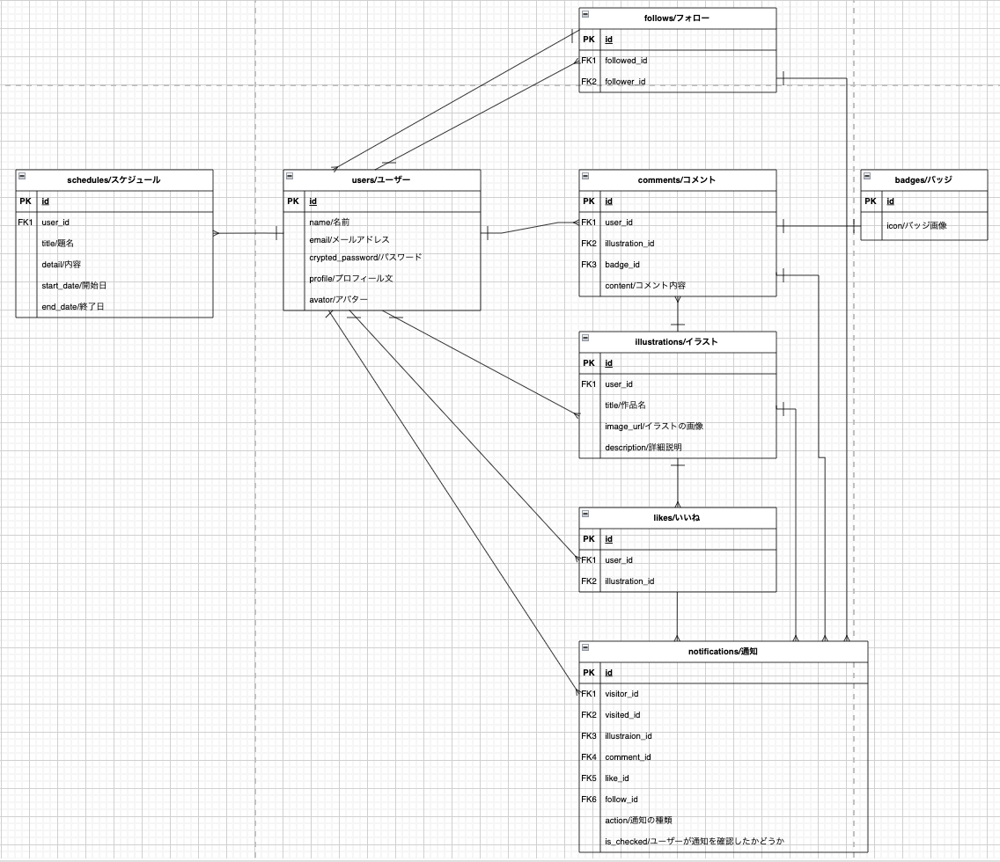

# [スケールアート]

## サービス概要
このアプリは、ユーザーがイラストを投稿するサービスです。
具体的に説明すると、イラストの成長を目標とする人々が、イラスト画像を一定期間毎に載せて、自身の成長を互いに見てもらうサービスです。
また、いいねを貰うことは嬉しいですが、コメントで反応を示してくれる方がモチベーションが上がりやすいと私は考えています。
特に、長期間又は初期からフォローしてくれている人から反応があればモチベーションが上がります。
そのため、その人がイラストにコメントをした際に、コメント欄ではその人の名前の横にバッジのようなアイコンを追加し、イラスト投稿したユーザーがその人に気づきやすいシステムにしたいとは思っています。

##　想定されるユーザー層
イラストを描き始めて数ヶ月程度の人
その中でも自分のイラストが上達するのを誰かに見てもらいたい人や、誰かにイラストを見てもらったり他人のイラストの成長を見たりしてモチベーションを保ちたい人

## ユーザーの獲得
自分自身や友人の協力を得て初期のボリュームを作り、どのようなサービスかユーザーに見てもらう。またXなどのSNSで、イラストやマンガを投稿している人に向けて、このサービスの存在やメリットを紹介します。そこでサービスの機能などの情報を発信します。

## サービスコンセプト
イラストが上手くなる為に描いていると、イラストに対して誰かからの反応が無いとモチベーションを維持するのが難しいと考えたため、上手くなるまでの過程を見てもらうサービスを考案しました。
自分は昔にイラストを描き始めていた頃、ネット上の仲が良かったコミュニティの方々が反応してくれたおかげで、モチベーションを保つことができたまま楽しく描き続けることができました。また同様に、時間が経つにつれて上達していく同じコミュニティのイラストを見て憧れたことに加え、上達すれば今よりも更に絵が楽しく描けるだろうなと私は刺激を受けました。これにより、昔と比べるとそんなに絵の腕前が上達したわけではありませんが、描くことに対しては時が経つにつれて楽しく感じられています。
そこで、絵を描き始めた人にとって、モチベーションを保ったまま楽しくイラストを上げることができる場所は良いと思い、このサービスを考えました。
このサービスでは、自分のイラストに自信が無いユーザーが反応が貰え、気軽に上げられるようなCGMしたいと考えています。

## 差別化、売りのポイント
他のイラスト投稿サービスは、会員登録時から高クオリティのイラストをアップするユーザーに注目が向けられるようになっています。
そのようなイラスト投稿サービスとの差別点を図るため、イラストを継続して上げているユーザーに注目が集まるピックアップ機能に加え、サービス概要で挙げた通り長くフォローしている人に気付きやすいシステムにすることで、イラスト初心者のユーザーでもモチベーションが上げやすいようにします。

## 実装を予定している機能
### MVP
* 会員登録
* ログイン
* イラスト一覧
* イラスト登録(ImageMagick、Rmagick、carrierwaveを使用します。)
* イラスト詳細
* フォロー機能
* いいね機能
* コメント機能(Websocket、ActionCableを使用します。)
* 検索機能

### その後の機能
* スケジュール機能
* イラストのランキング機能
* イラストを継続して上げているユーザーのピックアップ機能
* ユーザーの昔の絵と現在の絵を見比べられる機能
* 通知機能
* コメント欄に、長期間フォローしている人へのバッジアイコン機能

## 画面遷移図
画面遷移図:https://www.figma.com/file/hUM2i3edvNzfNVbgCIMusf/%E7%94%BB%E9%9D%A2%E9%81%B7%E7%A7%BB%E5%9B%B3?type=design&node-id=0%3A1&mode=design&t=BzQfx2IZ66SPHy9r-1
UI:https://www.figma.com/file/izCqevQLCJne6MxhrD0I9C/UI?type=design&node-id=0%3A1&mode=design&t=dVxVoqmIsdz1OIaz-1

## ER図
